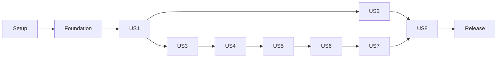

# Tasks: Ceramic and Tile Industrial Dashboard V1

**Input**: Design documents in `specs/001-industrial-dashboard/`.
**Created**: 2026-09-16
**Prerequisites**: [plan.md](plan.md), [spec.md](spec.md), [research.md](research.md),
[data-model.md](data-model.md), [REST](contracts/rest-api.md),
[integrations](contracts/integrations.md), [UI](contracts/ui.md), [quickstart.md](quickstart.md),
and [constitution](../../.specify/memory/constitution.md).

**Tests**: Included because the specification defines critical acceptance scenarios and its
engineering constraints invoke Constitution XII's mandatory automated critical-path tests.
Write the story tests before behavior implementation, observe the expected failure, then make
them pass. Foundational shared-schema setup is not a claim that a story already works.

**Organization**: Eight story phases in specification priority order. Checkboxes represent
implementation work still to do; this command implements no application code.

## Format: `[ID] [P?] [Story] Description`

- IDs are sequential; all tasks begin with an unchecked checkbox.
- `[P]` means the task can run beside other marked tasks in its **named prerequisite-ready batch**;
  it does not mean the task may run before setup or its story prerequisites.
- `[US1]`–`[US8]` map exactly to specification stories. Shared and final tasks have no story label.
- Indented quotations are binding parts of the parent task description, copied verbatim from
  the data model/specification to retain every field constraint and lifecycle rule.

## Path Conventions

Paths in tasks are repository-relative. API transport lives in `apps/api/src/modules/`, shared
backend domain/adapters in `packages/backend/src/`, worker handlers in `apps/worker/src/`, frontend
routes/features in `apps/web/src/`, generated public types in `packages/contracts/src/`, and all
schema changes in `prisma/schema.prisma` plus ordered Prisma migrations. Never create an alternate
ORM or let frontend code import backend persistence. API/worker reuse the same services.

All shared-schema/migration edits and generated contract/dictionary updates are serialized by
one owner. A quoted model may mention a future relation: add its FK in the explicitly identified
later story migration; never create a migration referencing a nonexistent table. Development/test
fixtures supply external dependencies for independent story verification, not production bypasses.

## Phase 1: Setup (Shared Infrastructure)

**Goal**: Create the pinned workspace and reproducible local validation environment.

- [X] T001 Initialize Node22/pnpm workspace with Next16/React19/Tailwind4, Nest11, Prisma7 and strict TypeScript in `package.json`, `pnpm-workspace.yaml`, `tsconfig.base.json`, `apps/web/package.json`, `apps/api/package.json`, `apps/worker/package.json`, `packages/backend/package.json`, and `packages/contracts/package.json`; lock compatible patches in `pnpm-lock.yaml` and keep provider SDKs backend-only.

- [X] T002 Configure ESLint/formatting and prohibit web imports of Prisma/backend implementation in `eslint.config.mjs` and `.prettierignore`; expose separate typecheck/lint/build scripts in `package.json` after the workspace task.

- [X] T003 [P] Create PostgreSQL17/Mailpit development services and optional S3 emulator in `infra/compose.dev.yml`, plus non-destructive lifecycle scripts in `scripts/infra.ts`; provide `infra:up`/`infra:stop`, guard test databases, and never delete volumes during normal stop.

- [X] T004 [P] Configure Jest/Supertest, Vitest/Testing Library and Playwright/axe projects in `jest.config.ts`, `vitest.config.ts`, `playwright.config.ts`, and `tests/helpers/environment.ts`; isolate test database/files, fa/en, three browser engines, desktop/tablet and narrow smoke viewports.

- [X] T005 [P] Document every integrations-contract configuration group with safe placeholders in `.env.example` and `.gitignore`; default to fake image generation and local mail/storage, exclude private images/reset secrets/build outputs, and never supply real credentials.

- [X] T006 Wire setup/test/build placeholders to real scaffold commands in `package.json` and safe process orchestration in `scripts/dev.ts`; start web/API/worker together and make unimplemented validation commands fail clearly rather than report success. Define the quickstart script names explicitly: `dev`, `db:migrate`, `db:seed:dev`, `admin:bootstrap`, `typecheck`, `lint`, `contracts:check`, `test:unit`, `test:integration`, `test:e2e`, `test:concurrency`, `test:load`, `test:recovery`, `validate:images`, and `build`; each later implementation task replaces its own failing placeholder, and final integration registers all handlers serially.

**Checkpoint**: All tasks in this phase must be complete before its dependent milestone.

---

## Phase 2: Foundational (Blocking Prerequisites)

**Goal**: Establish common persistence, validation, transport, localization, and test seams; no story begins until this phase passes.

- [X] T007 Configure Prisma7 driver, migrations, client lifecycle and decimal/revision helpers in `prisma/schema.prisma`, `prisma.config.ts`, and `packages/backend/src/infrastructure/prisma/prisma.service.ts`; enforce the quoted common conventions and use Prisma for every database access.

  Binding quotation (part of this task):

  > UUID identifiers; UTC timestamps; integer revisions for optimistic concurrency; normalized
  > email/SKU keys; exact decimals serialized as strings. Product price numeric(24,2), FX rate
  > numeric(24,6), dimensions numeric(12,2), stock numeric(24,3). Reject excess scale and values
  > outside column bounds, not silently round stored inputs. Currency enum `IRR | TOMAN | USD`;
  > TOMAN is an application label. All related domain rows have real foreign keys; avoid generic
  > polymorphic owner IDs for file references. Raw locking/partial-index SQL runs through Prisma
  > or Prisma migrations only. Never publish credential, storage-key, or provider-secret columns.

- [X] T008 Create shared User, GovernanceLock and AuditEvent persistence in `prisma/schema.prisma` and `prisma/migrations/001_identity_base/migration.sql`; implement only fields/constraints/seeded singleton, leaving story behavior to US1/US2.

  Binding quotation (part of this task):

  > Fields: id, displayName (1–100), email, emailNormalized (unique), passwordHash, role
  > (SUPER_ADMIN/ADMIN/PRODUCT_MANAGER/USER), approval (PENDING/APPROVED/REJECTED), disabledAt nullable,
  > locale (fa/en), authVersion, revision, createdAt, updatedAt. New registrations are PENDING USER.
  >
  > Transitions: PENDING → APPROVED or REJECTED by ADMIN for USER only or SUPER_ADMIN. Rejected
  > USER may be approved later by the same authority, with audit. Disabling/re-enabling preserves
  > approval and role; only APPROVED with disabledAt null can access protected business routes.
  > Pending/rejected login reveals only access status after password verification, without creating
  > a business session. Only SUPER_ADMIN changes roles. No user deletion in V1.
  >
  > Relationships: many authentication sessions, reset requests, visualization sessions, attempts,
  > audit actions; at most one saved room draft. Index role/approval/disabledAt for admin filtering.
  > Normalize email by trim + lowercase; never normalize passwords. No self-assigned role/status.
  > Lock a singleton governance row plus affected user when changing enabled SUPER_ADMIN membership;
  > prevent last-enabled-SUPER_ADMIN demotion/disable, including concurrent changes.
  >
  > Audit: id, actorId nullable FK (system events), action enum, targetType, targetIdentifier,
  > safe before/after fields, correlationId, createdAt. Targets are descriptive audit identifiers,
  > not asset access grants. Include account access changes, FX updates, session deletion and
  > safe security events; omit credential/image payloads. Retain account records referenced by audit.
  > GovernanceLock: singleton id/revision used to serialize last-admin invariants.

- [X] T009 [P] Implement validated external configuration in `packages/backend/src/config/config.ts` and `packages/backend/src/config/config.spec.ts`; reject missing/invalid production settings, expose only explicitly public settings, and prevent real provider use in automated tests.

- [X] T010 Create versioned Nest bootstrap, global DTO ValidationPipe, explicit public-route metadata and fail-closed guard seam in `apps/api/src/main.ts` and `apps/api/src/common/http.module.ts`; reject unknown fields, disable implicit floating-point money conversion, and use REST envelopes/statuses from contracts.

- [X] T011 Implement safe exception mapping, request IDs and structured redaction in `apps/api/src/common/exception.filter.ts` and `packages/backend/src/observability/logger.ts`; redact cookies, credentials, tokens, images, email bodies and provider payloads; log safe operation/outcome identifiers.

- [X] T012 Implement append-only safe audit writer in `packages/backend/src/audit/audit.service.ts` and its unit tests in `packages/backend/src/audit/audit.service.spec.ts`; persist actor/action/target/time and safe before/after values without image or secret payloads.

- [X] T013 Create injected work-runner/lease ports and standalone worker bootstrap in `packages/backend/src/infrastructure/jobs/job-runner.ts` and `apps/worker/src/main.ts`; support separate mail/image/cleanup concurrency, graceful shutdown and fencing, with concrete tables/handlers supplied by later stories.

- [X] T014 Create OpenAPI export and generated-client checks in `scripts/contracts.ts`, `packages/contracts/src/index.ts`, and `tests/contracts/route-policy.spec.ts`; provide `contracts:check`, preserve decimal strings and public enums, and never export Prisma types.

- [X] T015 Implement persistent locale provider, dictionaries and Material tokens in `apps/web/src/i18n/provider.tsx`, `apps/web/src/i18n/en.json`, `apps/web/src/i18n/fa.json`, `apps/web/src/app/globals.css`, and `apps/web/src/app/layout.tsx`; keep route/form identity stable, set lang/dir, use logical CSS, self-host a licensed Persian/Latin font, and keep currency independent.

- [X] T016 Create labelled fields, focusable error summaries, modal confirmations and status primitives in `apps/web/src/components/form-field.tsx`, `apps/web/src/components/error-summary.tsx`, `apps/web/src/components/confirm-dialog.tsx`, and `apps/web/src/components/status.tsx`; implement 48px controls, 4.5:1 text contrast, keyboard/focus and reduced-motion behavior.

- [X] T017 Create typed server/browser REST transport in `apps/web/src/lib/api/client.ts`, `apps/web/src/lib/api/server.ts`, and same-origin routing in `apps/web/next.config.ts`; translate error codes, support CSRF/revision/idempotency hooks, forward credentials only to configured Nest origin, and disable personalized caching.

- [X] T018 Create disposable Postgres fixtures, rollback/reset helpers and migration smoke tests in `tests/helpers/database.ts`, `tests/helpers/fixtures.ts`, and `tests/integration/foundation.spec.ts`; test config/DTO/error boundaries and run setup typecheck/lint/build gates before stories.

**Checkpoint**: Foundation gates pass before any story work.

---

## Phase 3: User Story 1 - Obtain and Use Authorized Access (Priority: P1) — MVP

**Goal**: Deliver registration, secure sessions, sign-out, and self-service password recovery.

**Independent Test**: Using an operator-approved fixture, sign in/out, observe pending access denial, replay/expire credentials, and recover by email; no catalog or administration UI required.

### Tests for User Story 1

- [X] T019 [P] [US1] Write auth/CSRF/current-user/preferences/reset route and DTO contract tests in `tests/contracts/auth.spec.ts`, including public-route allowlisting, generic acknowledgements and safe status codes.

- [X] T020 [P] [US1] Write registration/session/refresh/reset integration and concurrency tests in `tests/integration/auth.spec.ts` and `tests/concurrency/auth.spec.ts`; include duplicate normalized email, consumed token replay, superseded links and unchanged account approval.

- [X] T021 [P] [US1] Write bilingual sign-in/registration/logout/reset and expiry browser scenarios in `tests/e2e/auth.spec.ts`, with Mailpit/fake-time fixtures and no token leakage or automatic post-reset sign-in.

### Implementation for User Story 1

- [X] T022 [US1] Add AuthenticationSession, RefreshToken, PasswordReset and EmailOutbox in `prisma/schema.prisma` and `prisma/migrations/002_auth_sessions/migration.sql`; preserve all quoted nullable/unique/state/expiry constraints.

  Binding quotation (part of this task):

  > Session: id, userId FK, familyExpiresAt, revokedAt/reason, createdAt, authVersionAtIssue.
  > RefreshToken: id, sessionId FK, tokenHash unique, issuedAt, expiresAt, consumedAt, replacementId
  > nullable FK. Rotation locks current verifier and session; marks consumed and inserts replacement
  > atomically. Family expiry never extends beyond seven days. Consumed-token replay revokes family.
  > JWT includes sessionId/userId/version, but current role/status/session remain authoritative.
  > Every protected action checks these rows; logout revokes that session. Password reset revokes all.
  > Index sessions by user/revokedAt and token hash; delete expired token records after family expiry
  > plus a bounded security audit window, retaining only minimal audit events.
  >
  > Reset: id, userId FK, tokenHash unique, issuedAt, expiresAt (30 minutes), consumedAt,
  > supersededAt. Issuance locks user and supersedes prior unused requests. Consumption atomically
  > updates password, increments authVersion, revokes sessions, and consumes/supersedes links.
  >
  > EmailOutbox: id, resetId FK unique, encryptedPayload, encryptionKeyVersion, status
  > (QUEUED/SENDING/SENT/FAILED/EXPIRED), attemptCount, nextAttemptAt, leaseUntil, leaseToken,
  > lastSafeErrorCode, createdAt. Link ciphertext is deleted after send/expiry, not kept as history.
  > Queued mail verifies current reset validity before dispatch. Duplicate SMTP delivery may occur
  > following uncertain acknowledgement, but delivered links remain single-use. No email/token bodies
  > in logs. Generic recovery acknowledgement is independent of whether a row was created.

- [X] T023 [US1] Add rate-limit buckets and idempotency receipts in `prisma/schema.prisma` and `prisma/migrations/003_request_controls/migration.sql`; bind receipts to AuthenticationSession and retain their deletion-safe semantics.

  Binding quotation (part of this task):

  > Buckets: scope, subjectHash, windowStart, count, expiresAt; unique scope+subjectHash+windowStart.
  > Atomic increments avoid process-local enforcement. HMAC IP/email subjects to avoid raw personal
  > data in diagnostics; hash key stays secret. Defaults in the REST contract, configurable.
  > Receipt: userId FK, authSessionId FK, operation, key, payloadHash, response resource ID,
  > createdAt. Scope keys by operation/user, verify same payload, retain while original auth session
  > can retry. Deletion receipt yields RESOURCE_DELETED rather than resubmission.

- [X] T024 [US1] Implement email normalization, 12–128-character passphrases without truncation, Argon2id calibration/minimum parameters, pending USER registration and secure initial SUPER_ADMIN bootstrap in `packages/backend/src/identity/password.service.ts`, `packages/backend/src/identity/registration.service.ts`, and `scripts/bootstrap-admin.ts`; no public bootstrap or hardcoded password.

- [X] T025 [US1] Implement 15-minute JWT access cookies and seven-day absolute rotating hashed refresh families in `packages/backend/src/identity/session.service.ts`; validate algorithm/signature/issuer/audience/expiry/session, revoke replay families atomically, and serialize competing refreshes.

- [X] T026 [US1] Implement current-account/session checks, fixed capabilities, CSRF/session/pre-auth binding, trusted Origin and distributed auth limits in `apps/api/src/common/auth.guard.ts`, `apps/api/src/common/csrf.guard.ts`, and `packages/backend/src/identity/rate-limit.service.ts`; every protected operation uses current authority; include all REST limit thresholds.

- [X] T027 [US1] Implement hashed single-use reset issuance/consumption in `packages/backend/src/identity/password-reset.service.ts`; 30-minute expiry, supersede older links, atomic password/authVersion/session changes, trusted reset origin and non-disclosing request feedback.

- [X] T028 [US1] Implement encrypted reset-email outbox and TLS SMTP/Mailpit adapter in `packages/backend/src/infrastructure/mail/mail.service.ts`, `packages/backend/src/infrastructure/mail/smtp.adapter.ts`, and `apps/worker/src/handlers/email.handler.ts`; check supersession/expiry before send, retry same link at most twice, delete ciphertext after send/expiry and use en/fa templates.

- [X] T029 [US1] Implement all auth and self-preference DTO/controllers in `apps/api/src/modules/identity/auth.controller.ts`, `apps/api/src/modules/identity/auth.dto.ts`, and `apps/api/src/modules/identity/preferences.controller.ts`; expose no verifier/hash fields and return pending/rejected/disabled status only after valid credentials.

- [X] T030 [US1] Integrate cross-tab single-flight refresh, CSRF acquisition, safe retry keys and private-cache clearing in `apps/web/src/lib/api/auth-session.ts`; SSR never rotates tokens, replay/ambiguous refresh requires sign-in, and another account never receives the previous account’s drafts.

- [X] T031 [US1] Build login/register/forgot/reset pages in `apps/web/src/app/login/page.tsx`, `apps/web/src/app/register/page.tsx`, `apps/web/src/app/forgot-password/page.tsx`, `apps/web/src/app/reset-password/page.tsx`, and reusable fields in `apps/web/src/features/auth/auth-forms.tsx`; provide both languages and all validation/loading/success/error states.

- [X] T032 [US1] Add authenticated layout and minimal post-login landing shell in `apps/web/src/app/(protected)/layout.tsx` and `apps/web/src/app/(protected)/dashboard/page.tsx`; the complete dashboard belongs to US8; preserve same-account nonsecret form state on expiry and clear secrets/private UI on logout.

- [X] T033 [US1] Run US1 contract/integration/browser tests plus typecheck/lint/build and record actual results in `specs/001-industrial-dashboard/validation/us1.md`; prove immediate revocation and both-language recovery before closing US1.

**Checkpoint**: Story works against its prerequisite fixtures; record passing checks before declaring it complete.

---

## Phase 4: User Story 2 - Govern Accounts and Permissions (Priority: P1)

**Goal**: Deliver scoped account approval/access management and fixed-role assignment.

**Independent Test**: Seed all roles and verify ADMIN sees only USER accounts, SA assigns roles, next-action authority changes, and concurrent attempts cannot remove the final enabled SA.

### Tests for User Story 2

- [X] T034 [P] [US2] Write user-list/detail/approval/access/role/fixed-role route policy tests in `tests/contracts/users.spec.ts`, including scoped counts and inaccessible-record404.

- [X] T035 [P] [US2] Write account-management and last-enabled-SA races in `tests/integration/users.spec.ts` and `tests/concurrency/users.spec.ts`; verify role/status changes affect existing sessions immediately.

- [X] T036 [P] [US2] Write bilingual administrative journey and confirmation tests in `tests/e2e/users.spec.ts`; ADMIN searches must not reveal higher-role accounts and no role-definition editor may exist.

### Implementation for User Story 2

- [X] T037 [US2] Implement scoped user search, approval/rejection, disable/enable and SA-only roles in `packages/backend/src/identity/user-management.service.ts`; use User/GovernanceLock constraints from foundation, If-Match, audit and a consistent singleton/user lock order.

- [X] T038 [US2] Expose GET users/detail/roles, POST approval and PATCH access/role in `apps/api/src/modules/identity/users.controller.ts` and `apps/api/src/modules/identity/users.dto.ts`; validate target-role boundaries before any disclosure and forbid role-definition mutation.

- [X] T039 [US2] Build account list/detail and fixed-role inspection in `apps/web/src/app/(protected)/users/page.tsx`, `apps/web/src/app/(protected)/users/[id]/page.tsx`, and `apps/web/src/features/users/user-management.tsx`; provide search/paging, confirmations, conflict feedback, translated statuses and no password display.

- [X] T040 [US2] Run US2 route/race/browser suites and record evidence in `specs/001-industrial-dashboard/validation/us2.md`; prove pending approval and preservation of at least one enabled SA.

**Checkpoint**: Story works against its prerequisite fixtures; record passing checks before declaring it complete.

---

## Phase 5: User Story 3 - Maintain Ceramic and Tile Products (Priority: P1)

**Goal**: Deliver constrained product CRUD and three-currency pricing with SA-managed rates.

**Independent Test**: Create/edit/archive/restore/delete eligible products and verify exact currency examples, missing-rate behavior, concurrent SKU/rate conflicts and no image requirement.

### Tests for User Story 3

- [X] T041 [P] [US3] Write product CRUD/lifecycle/pricing route contracts in `tests/contracts/catalog.spec.ts`, covering unknown fields, currency strings, If-Match, role boundaries and PRODUCT_USED conflicts.

- [X] T042 [P] [US3] Write product lifecycle/normalized-SKU races and exact-money tests in `tests/integration/catalog.spec.ts`, `tests/concurrency/catalog.spec.ts`, and `packages/backend/src/pricing/conversion.spec.ts`; include USD2 at600000/700000, missing rates and HALF_UP boundaries.

- [X] T043 [P] [US3] Write bilingual create/edit/archive/restore/delete and rate-form journeys in `tests/e2e/catalog-management.spec.ts`; check valid-input retention, conflict recovery, confirmation cancel and optional blanks.

### Implementation for User Story 3

- [X] T044 [US3] Add Product fields/checks/indexes in `prisma/schema.prisma` and `prisma/migrations/004_catalog/migration.sql`; leave primaryImageId linkage for US4 migration, retain scalar default/nullable semantics and monotonic historical-use protection.

  Binding quotation (part of this task):

  > Fields: id, name, sku, skuNormalized unique, category, brand?, collection?, color, material,
  > widthMm, heightMm, thicknessMm?, finish, texture?, floorCompatible, wallCompatible,
  > suitability, slipResistance?, rectified, countryOfOrigin?, basePrice?, baseCurrency?, stockQuantity?,
  > unitOfSale, description?, active (default false), archivedAt?, primaryImageId?, revision,
  > createdBy FK, updatedBy FK, createdAt, updatedAt, everVisualized (default false).
  >
  > Use the exact controlled values and maximum text lengths in the spec's product table. Country
  > uses a canonical country code with translated display names. Product name and SKU retain entered
  > script; color/material etc. use language-neutral enum identifiers. Dimensions and usage label are
  > derived, not independently editable. At least one compatibility flag is true; required dimensions
  > are positive; ceramic/porcelain category requires matching material. Price/currency must both be
  > null or both populated. IRR/TOMAN price is integral, USD scale ≤2; stock nonnegative, whole for
  > piece/box. Blank optional fields persist as null rather than zero or false.
  >
  > Archive → archivedAt set, active false. Restore → archivedAt null, active false. Archived entries
  > are read-only. Hard delete only if everVisualized is false; the historical-use flag is monotonic
  > so deleting visualization history never makes a previously used product deletable. This is a
  > small deliberate denormalization supporting “used by previous visualizations” semantics.
  > Draft selections referencing a deletable product become unset through the catalog service.
  >
  > Indexes: unique skuNormalized; name/SKU trigram search indexes where query plans warrant,
  > name+sku stable ordering, active/archive/category, and measured compatibility/filter indexes.
  > Use `pg_trgm` only via migration; do not index every optional field speculatively.
  > Revisions gate edits, archive, restore, delete, and gallery mutations.

- [X] T045 [US3] Add immutable ExchangeRate and singleton PricingSettings in `prisma/schema.prisma` and `prisma/migrations/005_pricing/migration.sql`; seed empty current rate and retain quoted exact-decimal/revision constraints.

  Binding quotation (part of this task):

  > Rate: id, rialsPerUsd numeric(24,6) >0, previousRateId? FK, actorId FK, effectiveAt.
  > Rows immutable. PricingSettings: singleton id, currentRateId? FK, revision. SUPER_ADMIN-only
  > transaction compares revision, inserts rate, advances pointer, and audits before/after.
  > No editable rial/toman factor or automatic feed. Prices are not materialized in Product.
  >
  > Let R be rials/USD. Exact rial value is base for IRR, base×10 for TOMAN, base×R for USD.
  > Target IRR = rial value, TOMAN = rial value/10, USD = rial value/R. Return base unchanged;
  > round derived values HALF_UP at final display (0 decimals IRR/TOMAN, 2 USD). Missing R blocks
  > only cross-USD conversions; base USD still displays and IRR↔TOMAN still works. Return rate
  > revision/date on derived USD-related values, and FIXED_RATIO metadata for rial/toman-only values.
  > One response uses one rate snapshot, even if a concurrent update occurs.

- [X] T046 [US3] Implement product input/control enums and all field rules in `apps/api/src/modules/catalog/product.dto.ts` and `packages/backend/src/catalog/product.validation.ts`; reject excess scale/overflow before persistence and distinguish null from zero/false.

  Binding quotation (part of this task):

  > | Field | Required | Input and business validation |
  > | --- | --- | --- |
  > | Product name | Yes | Trimmed free text, 1–150 characters. |
  > | SKU / product code | Yes | Trimmed free text, 1–64 characters; unique per FR-010. |
  > | Category | Yes | Single controlled choice: ceramic tile, porcelain tile, mosaic tile. |
  > | Brand | No | Trimmed free text, up to 100 characters. |
  > | Collection | No | Trimmed free text, up to 100 characters. |
  > | Color | Yes | One primary controlled color: white, black, gray, beige, brown, red, blue, green, yellow, multicolor, other. |
  > | Material | Yes | Controlled choice: ceramic, porcelain, glass, natural stone, mixed; ceramic/porcelain categories require the matching material. |
  > | Dimensions | Derived | Display width × height, plus thickness when supplied, in millimeters; not independently editable. |
  > | Width / height | Yes | Positive finite decimal numbers in millimeters, up to two decimal places; mosaic dimensions describe the sold sheet. |
  > | Thickness | No | Positive finite decimal millimeters, up to two decimal places. |
  > | Surface / finish | Yes | Controlled choice: matte, polished, glossy, satin, textured, other. |
  > | Texture | No | Controlled choice: plain, stone-look, marble-look, wood-look, concrete-look, patterned, other. |
  > | Usage type | Derived | Floor, wall, or floor and wall, from compatibility flags. |
  > | Floor compatibility | Yes | Boolean; at least one of floor/wall compatibility must be true. |
  > | Wall compatibility | Yes | Boolean; at least one compatibility flag must be true. |
  > | Indoor/outdoor suitability | Yes | Controlled choice: indoor, outdoor, both. |
  > | Slip resistance | No | Free text, up to 100 characters, including rating scheme and value if supplied; blank displays “Not specified,” never an inferred safety rating. |
  > | Rectified | Yes | Boolean. |
  > | Country of origin | No | Selectable country name. |
  > | Price | No | One nonnegative finite base amount per unit of sale and selected base currency: Iranian rial, Iranian toman, or USD. Rial/toman base amounts are whole numbers; USD permits two decimal places. Other currency amounts are calculated using managed exchange rates. Blank means not supplied, not zero. |
  > | Stock quantity | No | Nonnegative finite decimal up to three decimal places in the stated sale unit; piece/box quantities must be whole numbers. Blank means unknown. |
  > | Unit of sale | Yes | Controlled choice: square meter, piece, box. |
  > | Description | No | Plain free text, up to 5,000 characters. |
  > | Active/inactive status | Yes | Controlled choice, inactive by default; archiving is a separate lifecycle action. |

- [X] T047 [US3] Implement create/read/update/archive/restore/delete in `packages/backend/src/catalog/product.service.ts`; unique trimmed case-insensitive SKU, inactive defaults, CAT editing versus ADM lifecycle authority, optimistic revisions and archived read-only enforcement; expose a domain invalidation hook for later draft/image integration.

- [X] T048 [US3] Implement exact base→rial→target arithmetic and SA-only audited rate revisions in `packages/backend/src/pricing/pricing.service.ts`; immutable base price, one rate snapshot per response, fixed10rial/toman, IRR/TOMAN integer base, USD2 decimals, rate6 decimals, final HALF_UP only and missing-rate status.

- [X] T049 [US3] Implement product detail/CRUD/archive/restore/delete DTO/controller binding in `apps/api/src/modules/catalog/products.controller.ts`; return safe computed detail and a basic bounded product list for management; US5 expands discovery filters.

- [X] T050 [US3] Implement current-rate GET/PUT in `apps/api/src/modules/pricing/pricing.controller.ts`; require SA write and revision check, include current revision/timestamp, and reject automatic-feed or toman-ratio mutation.

- [X] T051 [US3] Build reusable grouped product form and pages in `apps/web/src/features/products/product-form.tsx`, `apps/web/src/app/(protected)/products/new/page.tsx`, and `apps/web/src/app/(protected)/products/[id]/edit/page.tsx`; mirror feedback without moving authoritative business rules into UI.

- [X] T052 [US3] Build details, optional-data placeholders, lifecycle confirmations and currency views in `apps/web/src/app/(protected)/products/[id]/page.tsx` and `apps/web/src/features/products/product-detail.tsx`; preserve dirty same-account values on expiry/conflict and label base/derived prices.

- [X] T053 [US3] Build SA rate editor with previous/new rate example, confirmation and revision handling in `apps/web/src/app/(protected)/settings/exchange-rate/page.tsx` and `apps/web/src/features/pricing/exchange-rate-form.tsx`; locale switch must not alter currency.

- [X] T054 [US3] Run US3 suites/typecheck/lint/build and record evidence in `specs/001-industrial-dashboard/validation/us3.md`; validate every quoted product field and exact currency examples.

**Checkpoint**: Story works against its prerequisite fixtures; record passing checks before declaring it complete.

---

## Phase 6: User Story 4 - Maintain Product Images (Priority: P1)

**Goal**: Deliver validated private product galleries and safe file lifecycle.

**Independent Test**: Upload mixed files, reject duplicate/invalid/11th images, select/reorder/remove primary, verify role-gated media and retry without duplicate attachment.

### Tests for User Story 4

- [X] T055 [P] [US4] Write image-upload/status/primary/order/delete/content contract tests in `tests/contracts/product-images.spec.ts`, including no public asset-by-ID route and private no-store headers.

- [X] T056 [P] [US4] Write gallery concurrency, malformed/animated/oversized files and cleanup-restart tests in `tests/integration/product-images.spec.ts` and `tests/concurrency/product-images.spec.ts`; assert scoped duplicate detection and archived-product attachment rejection.

- [X] T057 [P] [US4] Write bilingual upload progress/per-file retry/primary/reorder/removal tests in `tests/e2e/product-images.spec.ts`, including keyboard move controls and no-image management.

### Implementation for User Story 4

- [X] T058 [US4] Add FileAsset, derivatives, ProductImage and product-target UploadReceipt in `prisma/schema.prisma` and `prisma/migrations/006_media/migration.sql`; add primaryImageId FK and defer room-target FK until US6, while preserving all quoted image/reference constraints.

  Binding quotation (part of this task):

  > Asset: id, storageBackend, storageKey unique, contentHash, mediaType, byteSize, width, height,
  > status (STAGED/VALIDATING/READY/REJECTED/DELETING/DELETED), creatorId FK, createdAt,
  > validatedAt?, rejectedCode?, deleteRequestedAt?. No global user-visible hash deduplication.
  > Display/provider derivatives: id, parentAssetId FK, purpose (PREVIEW/PROVIDER), storageKey,
  > mediaType, size/dimensions, status. Strip EXIF metadata; provider never receives original EXIF.
  > Only READY assets may be attached or read; browser responses contain contextual routes, not keys.
  >
  > Explicit live references: ProductImage.assetId; RoomDraft.originalAssetId;
  > VisualizationSession.originalAssetId; AttemptSurface.referenceAssetId;
  > GenerationAttempt.resultAssetId. Derived assets follow their parent lifetime. ProductImages
  > and AttemptSurfaces can refer to the same immutable validated image without sharing permissions.
  >
  > Validate still JPEG/PNG/WebP content, ≤10 MiB, ≤25MP, each dimension ≥256, one frame. File
  > validation state does not imply the room actually contains every requested surface. The adapter
  > may classify an unsuitable scene as a safe input failure; V1 does not require a separate ML
  > room classifier. Provider results undergo decode/size validation under a bounded result policy
  > before becoming READY; never stream unvalidated provider bytes to browsers.
  >
  > Cleanup: unreferenced staging expires after 24 hours. Lock assets during reference attachment
  > and transition to DELETING; DELETING prohibits new references. Only remove physical bytes after
  > all live references are absent; missing object is an idempotent success. Failed cleanup retries
  > with bounded backoff and remains observable; never restores deleted-domain access.
  >
  > Fields: id, productId FK, assetId FK, contentHash, position, createdAt. Unique(productId,
  > contentHash), unique(productId,position). Product.primaryImageId references an image belonging
  > to that product (composite FK or equivalent enforced migration constraint). Zero images means
  > null primary; nonempty means exactly one selected primary. No image can belong to two products.
  >
  > Lock product before attach/remove/reorder/primary selection; enforce max 10, full permutation
  > on reorder, gap-free committed order, and primary replacement. First successful attachment
  > becomes primary. Reordering preserves primary. Gallery removal releases that reference only;
  > attempt snapshots remain. Parallel reorder uses temporary positions in the same transaction or
  > a deferrable constraint to prevent transient uniqueness violations.
  >
  > Fields: id, uploaderId FK, stagedAssetId FK, productId? FK, draftOwnerId? FK,
  > expectedDraftRevision?, state (VALIDATING/READY/FAILED), attachedProductImageId? FK,
  > safeErrorCode?, createdAt, finishedAt?. Exactly one upload target is set. Validation job
  > references this receipt; READY means validated and successfully attached, not merely decoded.
  > Product attachment increments product revision; draft attachment checks its expected revision.
  > Receipts are scoped to uploader/SA and expire after 24 hours when terminal; retained idempotency
  > receipts prevent duplicate retry within the authenticated session. A deleted product while upload
  > is pending yields failed receipt and asset cleanup, not a dangling attachment.

- [X] T059 [US4] Add BackgroundJob persistence and ready-job index in `prisma/schema.prisma` and `prisma/migrations/007_jobs/migration.sql`; connect upload/cleanup targets now and generation/session targets in US6; use typed relations, not an alternate data-access library.

  Binding quotation (part of this task):

  > Fields: id, kind (GENERATION/ASSET_VALIDATE/ASSET_CLEANUP/SESSION_CLEANUP), typed domain target
  > FK where applicable, state (READY/RUNNING/SUCCEEDED/FAILED), availableAt, attemptCount,
  > leaseUntil?, fencingToken, lastErrorCode?, createdAt, updatedAt. Unique domain job key prevents
  > double enqueue. Claim with parameterized SKIP LOCKED through Prisma; heartbeat/terminal writes
  > require the current fencing token. Poll ready jobs every second; heartbeat 15s, lease 60s.
  > Safe transient work has at most two automatic retries inside its deadline; cleanup can be
  > requeued by the operator after bounded exhaustion. Stale generation dispatch is reconciled,
  > not blindly repeated. Email uses its specialized outbox lease with the same claim discipline.

- [X] T060 [US4] Implement private local and S3-compatible adapters in `packages/backend/src/infrastructure/storage/storage.service.ts`, `packages/backend/src/infrastructure/storage/local.adapter.ts`, and `packages/backend/src/infrastructure/storage/s3.adapter.ts`; confine keys, verify private access, and provide no permanent public URL.

- [X] T061 [US4] Implement bounded quarantine, hashing and upload receipts in `packages/backend/src/media/upload.service.ts`; stream at most10MiB, durable receipt/job enqueue, original preserved on failure, owner/SA-only status, and atomic idempotency.

- [X] T062 [US4] Implement isolated decode/inspection/EXIF-stripped derivatives and fenced job claiming in `apps/worker/src/handlers/image-validation.handler.ts` and `packages/backend/src/infrastructure/jobs/prisma-job.store.ts`; still JPEG/PNG/WebP, ≤25MP, each dimension≥256, exact content validation, lease60s/heartbeat15s/poll1s.

- [X] T063 [US4] Implement locked gallery attach/order/primary/remove and reference-aware cleanup in `packages/backend/src/catalog/gallery.service.ts`, `packages/backend/src/media/asset-cleanup.service.ts`, and `apps/worker/src/handlers/asset-cleanup.handler.ts`; max10, full permutation, first primary/next replacement, staging expiry24h and DELETING attachment exclusion.

- [X] T064 [US4] Bind product upload/gallery/receipt/content routes in `apps/api/src/modules/media/product-images.controller.ts`, `apps/api/src/modules/media/uploads.controller.ts`, and `apps/api/src/modules/media/private-content.controller.ts`; apply current context authorization, inspected MIME/nosniff/no-store and no Next image optimizer.

- [X] T065 [US4] Build per-file upload/gallery/primary/keyboard ordering and confirmation controls in `apps/web/src/features/products/product-gallery.tsx` and `apps/web/src/features/products/image-uploader.tsx`; integrate into product form/details with current revisions and translated limits/errors.

- [X] T066 [US4] Run US4 suites and storage adapter contract checks, recording evidence in `specs/001-industrial-dashboard/validation/us4.md`; prove no duplicate successes, exactly one primary and safe concurrent deletion/attachment.

**Checkpoint**: Story works against its prerequisite fixtures; record passing checks before declaring it complete.

---

## Phase 7: User Story 5 - Find a Suitable Product (Priority: P1)

**Goal**: Deliver reusable catalog search/filter/paging and eligible surface selection.

**Independent Test**: Use seeded mixed products to verify partial name/SKU search, filter AND/OR, status visibility, dimension orientation, thumbnails, empty results and retained filters.

### Tests for User Story 5

- [X] T067 [P] [US5] Write discovery query/response and surface-picker contract tests in `tests/contracts/product-search.spec.ts`; include default24/max100 paging, stable name/SKU order and bounded counts.

- [X] T068 [P] [US5] Write query integration and bilingual browser tests in `tests/integration/product-search.spec.ts` and `tests/e2e/product-discovery.spec.ts`; use active/inactive/archive/compatibility/no-image fixtures, empty results and back navigation.

### Implementation for User Story 5

- [X] T069 [US5] Implement indexed bounded discovery in `packages/backend/src/catalog/product-query.service.ts` and query DTOs in `apps/api/src/modules/catalog/product-query.dto.ts`; partial case-insensitive search, AND filter types/OR values, exact width/height orientation, and selectionSurface cannot bypass active/compatible/usable-primary rules.

- [X] T070 [US5] Profile representative queries and add justified name/SKU trigram or filter indexes through `prisma/migrations/008_catalog_search/migration.sql`; record EXPLAIN evidence in `specs/001-industrial-dashboard/validation/search-query-plans.md` and avoid speculative indexes.

- [X] T071 [US5] Implement reusable filterable grid and picker in `apps/web/src/features/products/catalog.tsx`, `apps/web/src/features/products/product-picker.tsx`, and `apps/web/src/app/(protected)/products/page.tsx`; retain query/paging in navigation, show images/placeholders and hide inaccessible status controls.

- [X] T072 [US5] Integrate GET products with query service, run US5 suites and record measured search evidence in `specs/001-industrial-dashboard/validation/us5.md`; verify ordinary USER cannot discover inactive/archived records via direct query.

**Checkpoint**: Story works against its prerequisite fixtures; record passing checks before declaring it complete.

---

## Phase 8: User Story 6 - Visualize Floor and Wall Choices (Priority: P1)

**Goal**: Deliver durable room drafts, accepted generation, progress, results, failure and retry.

**Independent Test**: From an eligible seeded catalog, complete floor-only/wall-only/both, navigate/refresh during work, simulate timeout/uncertain dispatch, and prove one active attempt with immutable inputs.

### Tests for User Story 6

- [ ] T073 [P] [US6] Write room-draft/upload/policy/attempt submission/detail/content contracts in `tests/contracts/generation.spec.ts`; include virtual empty GET without writes, draft revision, consent version and request idempotency.

- [ ] T074 [P] [US6] Write job lease/fencing, eligibility/idempotency, product-change snapshots and active-slot acceptance races in `tests/integration/generation.spec.ts` and `tests/concurrency/generation.spec.ts`; use deterministic failure adapters and real Postgres.

- [ ] T075 [P] [US6] Write bilingual floor/wall/both, draft persistence, language-switch, navigation, progress, result and retry journeys in `tests/e2e/generation.spec.ts`; verify no duplicate submit and no fabricated percentage.

### Implementation for User Story 6

- [ ] T076 [US6] Add RoomDraft and VisualizationSession plus room-target UploadReceipt constraints in `prisma/schema.prisma` and `prisma/migrations/009_visualization_sessions/migration.sql`; activate both-target exclusivity only once room relations exist.

  Binding quotation (part of this task):

  > Fields: id, ownerId unique FK, originalAssetId? FK, sourceSessionId? FK, predecessorAttemptId?
  > FK, selectedFloorProductId? FK, selectedWallProductId? FK, floorSelected, wallSelected,
  > revision, updatedAt, expiresAt. Persist selected values after successful upload/change, retained
  > for 24 hours after last edit; explicit discard removes draft references. Incomplete drafts are
  > valid; submission validates completeness/current catalog eligibility. Replacing original image
  > clears session linkage and requires the UI's discard confirmation. No transfer between accounts.
  >
  > For SUPER_ADMIN variation from another owner: create a new actor-owned session on acceptance,
  > retaining the authorized original image through its own reference. Do not add the actor's attempt
  > to the original owner's session. Subsequent deletion of either session respects shared assets.
  >
  > Fields: id, ownerId FK, originalAssetId FK, createdAt, deletedAt?, deletedBy? FK. One original
  > per session. Many attempts, each owned by session owner. Original replacement creates a new
  > session; same-original variations stay in the same owner's session. No automatic expiry.
  > Deleted session becomes an inaccessible minimal tombstone used for cleanup/restore safety;
  > full snapshots and image references are removed during cleanup. No public listing of tombstones.

- [ ] T077 [US6] Add GenerationAttempt/AttemptSurface, partial active-owner uniqueness and typed BackgroundJob targets in `prisma/schema.prisma` and `prisma/migrations/010_generation_attempts/migration.sql`; include a persisted dispatch marker/fence and captured consent policy version required by integrations.

  Binding quotation (part of this task):

  > Attempt: id, ownerId FK, sessionId FK, predecessorId? FK, status
  > (PREPARING/GENERATING/COMPLETED/FAILED), acceptedAt, deadlineAt, startedAt?, finishedAt?,
  > resultAssetId? FK, safeErrorCode?, providerName, model, promptVersion, effectiveParameters,
  > providerRequestId?, inputDigest, idempotencyKey, payloadHash, revision.
  >
  > Surface: id, attemptId FK, surface (FLOOR/WALL), productId FK, referenceAssetId FK,
  > productSnapshot (name, SKU, dimensions, material, finish, color, texture, compatibility),
  > referenceHash. Unique(attemptId,surface); require one or two according to requested choices.
  > No mutable product field substitutes for captured appearance context. This snapshot is justified
  > historical data, not an alternative catalog source of truth.
  >
  > Unique(ownerId,idempotencyKey) plus partial unique(ownerId) where status PREPARING/GENERATING.
  > Acceptance locks owner and selected product/image rows, verifies account and draft revision,
  > sets product.everVisualized, creates session if needed, copies references, creates attempt/job,
  > and commits atomically. Same key+payload replays the original acknowledgement; differing payload
  > conflicts. Keep a separate minimal idempotency receipt after session deletion so an old retried
  > submission cannot recreate deleted work; delete receipts when their auth session is expired.
  >
  > Transitions: PREPARING → GENERATING → COMPLETED or FAILED; PREPARING may fail. No terminal →
  > active transition. Retry is a new attempt linked to predecessor. Deadline is acceptance+10min,
  > including queued time. COMPLETED requires a READY result reference. Dispatch uncertainty becomes
  > FAILED/PROVIDER_OUTCOME_UNKNOWN; no automatic paid duplicate. Late output cannot change terminal
  > status. Product edits/removal after acceptance do not change captured inputs.
  >
  > Session deletion locks session and owner active slot, checks no active attempt, sets tombstone,
  > audits, and enqueues cleanup. New attempts cannot attach to tombstoned sessions. Deletion/acceptance
  > must use the same lock ordering. Foreign-key cleanup removes attempt references before removing
  > files; no cascade may bypass live asset checks. Catalog everVisualized remains true.

- [ ] T078 [US6] Implement own-draft create/update/discard/24h expiry and room upload replacement in `packages/backend/src/visualization/draft.service.ts`; incomplete drafts allowed, virtual revision0 on missing GET, If-Match attach, preserved old image on failure, product-delete invalidation and no account transfer.

- [ ] T079 [US6] Define ImageGenerationService and deterministic adapter in `packages/backend/src/infrastructure/images/image-generation.ts` and `packages/backend/src/infrastructure/images/fake.adapter.ts`; accept room/reference bytes, surface context, deadline and effective parameters without SDK types in domain code.

- [ ] T080 [US6] Implement configurable image-edit adapter in `packages/backend/src/infrastructure/images/openai.adapter.ts` and server prompt in `packages/backend/src/infrastructure/images/prompts/room-surfaces-v1.ts`; verify configured model capabilities against current official docs before live use, send room first/one reference per surface, disable uncertain implicit retries, and keep one output/no Files conversation state.

- [ ] T081 [US6] Implement atomic eligibility/revision/consent/account checks and submission in `packages/backend/src/visualization/accept-attempt.service.ts`; capture immutable product/reference context, set everVisualized, allocate session/attempt/job and one active slot, and return original receipt for identical key/payload.

- [ ] T082 [US6] Implement generation job handler in `apps/worker/src/handlers/generation.handler.ts`; persist possible-dispatch before external call, fence all writes, cap safe retries to two, heartbeat15s/lease60s, and fail OUTCOME_UNKNOWN rather than create a duplicate paid request.

- [ ] T083 [US6] Implement result validation/attachment and deadline reconciliation in `packages/backend/src/visualization/complete-attempt.service.ts` and `packages/backend/src/visualization/deadline.service.ts`; cap provider results25MiB/25MP, require READY result, acceptance+10min total, terminal immutability and cleanup of late output.

- [ ] T084 [US6] Bind room draft/policy/submit/detail/private original/reference/result routes in `apps/api/src/modules/visualization/drafts.controller.ts`, `apps/api/src/modules/visualization/attempts.controller.ts`, and `apps/api/src/modules/visualization/policy.controller.ts`; verify ownership and no-store media on every read.

- [ ] T085 [US6] Implement from-attempt draft population and deliberate retry in `packages/backend/src/visualization/variation.service.ts`; use new key/attempt and current eligibility, retain failed predecessor and create actor-owned session when SA uses another owner’s original.

- [ ] T086 [US6] Build room upload, surface controls, reused product picker, consent and autosaved draft UI in `apps/web/src/features/visualization/room-draft.tsx` and `apps/web/src/app/(protected)/visualization/page.tsx`; confirm original replacement, preserve inputs/locale and explain missing references.

- [ ] T087 [US6] Build attempt polling and accessible comparison in `apps/web/src/features/visualization/attempt-progress.tsx`, `apps/web/src/features/visualization/image-comparison.tsx`, and `apps/web/src/app/(protected)/visualizations/[attemptId]/page.tsx`; poll2s while visible, resume on return, show safe errors/retry and one-active link.

- [ ] T088 [US6] Wire draft expiry, staged/result cleanup and recovery handlers in `apps/worker/src/handlers/draft-expiry.handler.ts` and `packages/backend/src/visualization/recovery.service.ts`; preserve submitted sessions indefinitely, reconcile elapsed deadlines before reads, and keep deleted-receipt replays from recreating work.

- [ ] T089 [US6] Run US6 contract/job/race/browser suites and record evidence in `specs/001-industrial-dashboard/validation/us6.md`; demonstrate accepted status≤2s, terminal≤10min including queue time, navigation survival, captured inputs and no uncertain automatic duplicate.

**Checkpoint**: Story works against its prerequisite fixtures; record passing checks before declaring it complete.

---

## Phase 9: User Story 7 - Revisit and Vary Visualizations (Priority: P2)

**Goal**: Deliver owned/all-history browsing, variations and SA-only permanent session deletion.

**Independent Test**: Seed two owners and shared assets; verify own-history and SA scope, historical snapshots after catalog changes, actor-owned variations and deletion without breaking shared images.

### Tests for User Story 7

- [ ] T090 [P] [US7] Write history/filter/scope and session-delete contracts in `tests/contracts/history.spec.ts`; protect direct private image routes and require deletion confirmation owner/session IDs.

- [ ] T091 [P] [US7] Write deletion-versus-acceptance, shared references, tombstone replay and cleanup-failure tests in `tests/integration/history.spec.ts` and `tests/concurrency/history.spec.ts`; after deletion no role may access exclusive images.

- [ ] T092 [P] [US7] Write bilingual history/variation/SA-delete browser tests in `tests/e2e/history.spec.ts`; active attempt blocks deletion, cancel changes nothing, and ADMIN never sees another owner’s records/counts.

### Implementation for User Story 7

- [ ] T093 [US7] Implement paginated own/all history with newest-first ordering, status/owner filters and immutable detail in `packages/backend/src/visualization/history.service.ts`; default20/max100, only SA all-history, and nondeleted records only.

- [ ] T094 [US7] Implement shared-lock-order tombstone/audit/cleanup enqueue in `packages/backend/src/visualization/delete-session.service.ts` and cleanup worker in `apps/worker/src/handlers/session-cleanup.handler.ts`; block active attempts, revoke access immediately, preserve minimal receipt/tombstone and shared live references without image payloads.

- [ ] T095 [US7] Expose scoped attempt-list and SA deletion routes in `apps/api/src/modules/visualization/history.controller.ts`; integrate result/detail policies from US6, stale/deleted resource handling and contextual media403/404 behavior.

- [ ] T096 [US7] Build history filters, linked variations and owner-aware delete confirmation in `apps/web/src/app/(protected)/visualizations/page.tsx`, `apps/web/src/features/visualization/history-list.tsx`, and `apps/web/src/features/visualization/session-delete-dialog.tsx`; invalidate counts/detail after deletion and keep variation original owner separate from actor.

- [ ] T097 [US7] Run US7 suites and document proof in `specs/001-industrial-dashboard/validation/us7.md`; catalog image removal must preserve history until SA deletion, with no automatic session expiry or public sharing.

**Checkpoint**: Story works against its prerequisite fixtures; record passing checks before declaring it complete.

---

## Phase 10: User Story 8 - Navigate the Daily Dashboard (Priority: P2)

**Goal**: Complete the role-aware dashboard and consistent bilingual navigation.

**Independent Test**: Sign in under each role; verify scoped counts/links, allowed shortcuts, persistent language changes without state loss, and keyboard/tablet completion.

### Tests for User Story 8

- [ ] T098 [P] [US8] Write dashboard count/link/scope contracts in `tests/contracts/dashboard.spec.ts` and integration checks in `tests/integration/dashboard.spec.ts`; verify SA all-history count and own-only counts for every other role.

- [ ] T099 [P] [US8] Write desktop/tablet/narrow bilingual navigation/accessibility scenarios in `tests/e2e/dashboard.spec.ts`; switch language during dirty forms and generation without losing state or exposing hidden shortcuts.

### Implementation for User Story 8

- [ ] T100 [US8] Implement scoped aggregate queries in `packages/backend/src/dashboard/dashboard.service.ts` and GET dashboard in `apps/api/src/modules/dashboard/dashboard.controller.ts`; avoid N+1, personalized no-store and count/destination filter mismatch.

- [ ] T101 [US8] Complete dashboard and reusable navigation in `apps/web/src/app/(protected)/dashboard/page.tsx`, `apps/web/src/features/dashboard/dashboard.tsx`, and `apps/web/src/components/app-navigation.tsx`; Products/Visualization/History plus permitted AddProduct/UserManagement and SA exchange-rate destination.

- [ ] T102 [US8] Run US8 and cross-route locale/accessibility checks, recording evidence in `specs/001-industrial-dashboard/validation/us8.md`; verify loading/empty/error states, focus order and full en/fa dictionary coverage.

**Checkpoint**: Story works against its prerequisite fixtures; record passing checks before declaring it complete.

---

## Phase 11: Polish & Cross-Cutting Concerns

**Goal**: Prove release gates, performance, operational safety and reproducible quickstart across the complete V1.

- [ ] T103 Complete representative catalog, images, four-role, pending/rejected/disabled and shared-history fixtures in `prisma/seed.ts` and `tests/fixtures/visual-quality/cases.json`; guard dev/test environments, preserve secure bootstrap, and implement `db:seed:dev`.

- [ ] T104 Complete generated OpenAPI/client inventory and verify every REST operation in `scripts/contracts.ts`, `packages/contracts/src/generated.ts`, and `tests/contracts/route-policy.spec.ts`; reject unknown DTO fields and accidental public routes; document requirements-to-test mapping in `specs/001-industrial-dashboard/validation/coverage.md`.

- [ ] T105 [P] Implement and run10,000-product/50-active-user load scenarios in `tests/load/dashboard.ts` and `scripts/test-load.ts`; profile/fix queries and record p95 search≤2s/dashboard-history≤3s in `specs/001-industrial-dashboard/validation/performance.md`.

- [ ] T106 [P] Implement isolated restore/deletion-ledger replay and worker/SMTP/object failure drills in `tests/recovery/restore.spec.ts` and `scripts/test-recovery.ts`; validate ≤24h recovery point/≤4h restore targets without production data, documenting results in `specs/001-industrial-dashboard/validation/recovery.md`.

- [ ] T107 [P] Complete health/readiness, redacted metrics and operator retry tooling in `apps/api/src/modules/health/health.controller.ts`, `packages/backend/src/observability/metrics.ts`, and `scripts/requeue-job.ts`; monitor queue age/timeouts/mail/cleanup and document alerts/backup/key rotation in `docs/operations.md`.

- [ ] T108 [P] Add nonroot Linux production containers and same-origin routing configuration in `apps/web/Dockerfile`, `apps/api/Dockerfile`, `apps/worker/Dockerfile`, and `infra/compose.production.example.yml`; externalize TLS/secrets/storage settings and validate builds locally without deploying.

- [ ] T109 Run cross-role/security/privacy regressions in `tests/integration/security.spec.ts` and review dependency/config/token/redaction boundaries; record findings and resolutions in `specs/001-industrial-dashboard/validation/security.md`, including cookie/CSRF, replay, deleted media and missing production config.

- [ ] T110 Implement opt-in30-case provider evaluation and three-reviewer rubric in `scripts/validate-images.ts` and `docs/visual-quality-review.md`; use first attempt only, failed attempt counts, at least24/30 cases with2/3 agreement on all4 criteria, and never enable paid generation in automated tests.

- [ ] T111 With real-provider authorization and credentials, run `scripts/validate-images.ts` plus business scoring and capture actual SC-006 evidence in `specs/001-industrial-dashboard/validation/visual-quality.md`; verify model access and applicable provider/retention notice. If unavailable, leave this task unchecked with the concrete external blocker rather than substitute fake output.

- [ ] T112 Conduct SC-002/003/005 task-completion checks with10 representative staff and record observed timings/results in `specs/001-industrial-dashboard/validation/usability.md`; verify90% completion within2/5/3minutes respectively and do not invent participant evidence.

- [ ] T113 Run every implemented quickstart script, complete SC-001–009 and constitution gates, and update `specs/001-industrial-dashboard/quickstart.md`, `README.md`, and `specs/001-industrial-dashboard/validation/release.md` with actual setup/typecheck/lint/contracts/unit/integration/e2e/build/concurrency/load/recovery outcomes plus real SMTP delivery and remaining external blockers.

**Checkpoint**: All tasks in this phase must be complete before its dependent milestone.

---

## Dependencies & Execution Order

### Phase Dependencies

Setup → Foundation → story phases → final integration/release gates. Numeric order is the
safe single-developer execution order. Tasks within a story follow tests → models → services →
controllers → UI integration → verification. Test authoring can be parallel; passing tests wait
for the relevant implementation. No automatic deployment is requested.

### User Story Dependencies

| Story | Prerequisites for complete delivery | Independent validation boundary |
| --- | --- | --- |
| US1 | Foundation | Seed approved/pending identities; no catalog required |
| US2 | US1 | Account fixtures only; no product/generation required |
| US3 | US1 | Seed role identities; no images needed for basic product lifecycle |
| US4 | US1 + US3 | Prepared products and private storage; no generation required |
| US5 | US1 + US3 + US4 | Mixed catalog/image fixtures; picker tested outside generation |
| US6 | US1 + US3 + US4 + US5 | Eligible catalog and fake provider; own attempt detail works before history list |
| US7 | US6 | Seed two-owner completed/failed attempts; test deletion and variations independently |
| US8 | US1 + US2 + US3 + US5 + US7 | Scoped aggregate fixtures and all destination routes |

These are real dependencies; independently testable does not mean dependency-free. US1's MVP
uses a minimal landing shell and operator-approved fixtures. US2 adds approval UI. US6 includes
own attempt detail and retry so it is not blocked on US7's list/all-history/deletion UI.

### Within Each User Story

- Use the exact model quotations and contract semantics; do not replace null with zero or silently
  widen permissions. Fields deferred to later relations must have explicit follow-up migrations.
- Migration modifications, shared dictionary updates, generated types and app/module registration
  are sequential integration operations even when feature files can be authored independently.
- Run tests at story completion; a checkbox is not complete merely because a file exists.
- Cross-story APIs use their module's public service interface, not another module's Prisma internals.

### Parallel Opportunities

Setup batch after T001–T002: T003, T004, T005 have disjoint files; integrate scripts afterward.

Foundation T009 can run alongside T010 once T008 is done; shared bootstrap registration remains sequential.

US2 and US3 behavioral files can progress after US1, but shared schema/dictionary/contracts integration has one owner.

Final independent batch after fixture/contract consolidation: T105, T106, T107, T108. Their declared output files are disjoint; merge shared script registrations sequentially.

## Parallel Example: User Story 1

After the story prerequisites above pass, author these disjoint test files together:

- `T019`: Write auth/CSRF/current-user/preferences/reset route and DTO contract tests in `tests/contracts/auth.spec.ts`, including public-route allowlisting, generic acknowledgements and safe status codes.
- `T020`: Write registration/session/refresh/reset integration and concurrency tests in `tests/integration/auth.spec.ts` and `tests/concurrency/auth.spec.ts`; include duplicate normalized email, consumed token replay, superseded links and unchanged account approval.
- `T021`: Write bilingual sign-in/registration/logout/reset and expiry browser scenarios in `tests/e2e/auth.spec.ts`, with Mailpit/fake-time fixtures and no token leakage or automatic post-reset sign-in.

Then execute the implementation tasks in listed order and run all story tests. No shared-schema task in this phase is marked parallel.

## Parallel Example: User Story 2

After the story prerequisites above pass, author these disjoint test files together:

- `T034`: Write user-list/detail/approval/access/role/fixed-role route policy tests in `tests/contracts/users.spec.ts`, including scoped counts and inaccessible-record404.
- `T035`: Write account-management and last-enabled-SA races in `tests/integration/users.spec.ts` and `tests/concurrency/users.spec.ts`; verify role/status changes affect existing sessions immediately.
- `T036`: Write bilingual administrative journey and confirmation tests in `tests/e2e/users.spec.ts`; ADMIN searches must not reveal higher-role accounts and no role-definition editor may exist.

Then execute the implementation tasks in listed order and run all story tests. No shared-schema task in this phase is marked parallel.

## Parallel Example: User Story 3

After the story prerequisites above pass, author these disjoint test files together:

- `T041`: Write product CRUD/lifecycle/pricing route contracts in `tests/contracts/catalog.spec.ts`, covering unknown fields, currency strings, If-Match, role boundaries and PRODUCT_USED conflicts.
- `T042`: Write product lifecycle/normalized-SKU races and exact-money tests in `tests/integration/catalog.spec.ts`, `tests/concurrency/catalog.spec.ts`, and `packages/backend/src/pricing/conversion.spec.ts`; include USD2 at600000/700000, missing rates and HALF_UP boundaries.
- `T043`: Write bilingual create/edit/archive/restore/delete and rate-form journeys in `tests/e2e/catalog-management.spec.ts`; check valid-input retention, conflict recovery, confirmation cancel and optional blanks.

Then execute the implementation tasks in listed order and run all story tests. No shared-schema task in this phase is marked parallel.

## Parallel Example: User Story 4

After the story prerequisites above pass, author these disjoint test files together:

- `T055`: Write image-upload/status/primary/order/delete/content contract tests in `tests/contracts/product-images.spec.ts`, including no public asset-by-ID route and private no-store headers.
- `T056`: Write gallery concurrency, malformed/animated/oversized files and cleanup-restart tests in `tests/integration/product-images.spec.ts` and `tests/concurrency/product-images.spec.ts`; assert scoped duplicate detection and archived-product attachment rejection.
- `T057`: Write bilingual upload progress/per-file retry/primary/reorder/removal tests in `tests/e2e/product-images.spec.ts`, including keyboard move controls and no-image management.

Then execute the implementation tasks in listed order and run all story tests. No shared-schema task in this phase is marked parallel.

## Parallel Example: User Story 5

After the story prerequisites above pass, author these disjoint test files together:

- `T067`: Write discovery query/response and surface-picker contract tests in `tests/contracts/product-search.spec.ts`; include default24/max100 paging, stable name/SKU order and bounded counts.
- `T068`: Write query integration and bilingual browser tests in `tests/integration/product-search.spec.ts` and `tests/e2e/product-discovery.spec.ts`; use active/inactive/archive/compatibility/no-image fixtures, empty results and back navigation.

Then execute the implementation tasks in listed order and run all story tests. No shared-schema task in this phase is marked parallel.

## Parallel Example: User Story 6

After the story prerequisites above pass, author these disjoint test files together:

- `T073`: Write room-draft/upload/policy/attempt submission/detail/content contracts in `tests/contracts/generation.spec.ts`; include virtual empty GET without writes, draft revision, consent version and request idempotency.
- `T074`: Write job lease/fencing, eligibility/idempotency, product-change snapshots and active-slot acceptance races in `tests/integration/generation.spec.ts` and `tests/concurrency/generation.spec.ts`; use deterministic failure adapters and real Postgres.
- `T075`: Write bilingual floor/wall/both, draft persistence, language-switch, navigation, progress, result and retry journeys in `tests/e2e/generation.spec.ts`; verify no duplicate submit and no fabricated percentage.

Then execute the implementation tasks in listed order and run all story tests. No shared-schema task in this phase is marked parallel.

## Parallel Example: User Story 7

After the story prerequisites above pass, author these disjoint test files together:

- `T090`: Write history/filter/scope and session-delete contracts in `tests/contracts/history.spec.ts`; protect direct private image routes and require deletion confirmation owner/session IDs.
- `T091`: Write deletion-versus-acceptance, shared references, tombstone replay and cleanup-failure tests in `tests/integration/history.spec.ts` and `tests/concurrency/history.spec.ts`; after deletion no role may access exclusive images.
- `T092`: Write bilingual history/variation/SA-delete browser tests in `tests/e2e/history.spec.ts`; active attempt blocks deletion, cancel changes nothing, and ADMIN never sees another owner’s records/counts.

Then execute the implementation tasks in listed order and run all story tests. No shared-schema task in this phase is marked parallel.

## Parallel Example: User Story 8

After the story prerequisites above pass, author these disjoint test files together:

- `T098`: Write dashboard count/link/scope contracts in `tests/contracts/dashboard.spec.ts` and integration checks in `tests/integration/dashboard.spec.ts`; verify SA all-history count and own-only counts for every other role.
- `T099`: Write desktop/tablet/narrow bilingual navigation/accessibility scenarios in `tests/e2e/dashboard.spec.ts`; switch language during dirty forms and generation without losing state or exposing hidden shortcuts.

Then execute the implementation tasks in listed order and run all story tests. No shared-schema task in this phase is marked parallel.

## Implementation Strategy

### MVP First (User Story 1 Only)

Complete Setup, Foundation and US1; demonstrate pending registration, approved sign-in/out and
email recovery with isolated seeded accounts. This is the first technical increment, not the full
business product. No production launch claim is implied.

### Incremental Delivery

Add US2 for business-managed onboarding; US3–US5 for a useful managed catalog; US6 for room
visualization; US7 for history/deletion; US8 for the complete daily dashboard. Validate each slice
before moving on. All eight stories and final gates are required for the requested V1.

### Parallel Team Strategy

Split only the documented disjoint test/setup batches once prerequisites pass. Assign one owner
for Prisma schema/migration sequencing, generated contracts and shared locale dictionaries.
UI/service authors may use stable contract fixtures, but their task is complete only after real
integration and applicable gates pass. This describes implementation opportunities and does not
spawn agents during task generation.

## Requirement Coverage

| Requirement group | Primary implementation tasks | Acceptance evidence |
| --- | --- | --- |
| FR-001–004 | T024, T025, T026, T027, T028, T029, T031 | T033 |
| FR-005–008 | T037, T038, T039, T026 | T040 |
| FR-009–015 | T044, T046, T047, T048, T050, T053 | T054 |
| FR-016–018 | T069, T070, T071, T052 | T072 |
| FR-019–021 | T058, T060, T061, T062, T063, T064, T065 | T066 |
| FR-022–030 | T078, T079, T080, T081, T082, T083, T084, T085, T086, T087, T088 | T089 |
| FR-031–033 | T093, T094, T095, T096 | T097 |
| FR-034–036 | T015, T016, T100, T101 | T102 |
| SC-001–009 | T109, T105, T106, T111, T112, T113 | T113 |

## Notes

- No application source or infrastructure is created by task generation; only this task artifact.
- Preserve approved scope: pending USER registration, ADMIN→USER-only management and own history,
  four fixed roles, SA-only rates/deletion, Persian/English, IRR/TOMAN/USD and email reset.
- Post-generation hooks: none configured when generated.
- Real-provider evaluation, staff usability measurements and SMTP/restore proof are release work,
  not evidence that can be replaced by deterministic mocks. Leave blocked tasks unchecked and
  identify missing credentials/authorization/participants; continue independent implementation work.
- Shared model quotations intentionally describe final state; they do not permit implementing
  later user-story behavior prematurely or leaving incomplete FKs in a committed migration.
- Suggested next workflow: `$speckit-analyze` before `$speckit-implement`.
